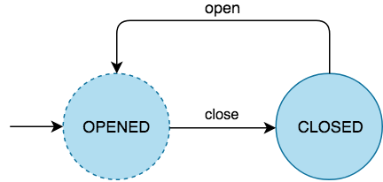

## Simple State Machine
A [Deterministic Finite State Machine ](https://en.wikipedia.org/wiki/Deterministic_finite_automaton) implementation written in Java. 

|Name|Description|
|--|--|
|State|the condition of a machine|
|Action|an input that triggers a transition and an event|
|Event|the "in between" occurence before the actual transition|
|Transition|the movement between two states triggered by an action|

## How to use it
A simple model for opening and closing a door

</img>

Let's convert this diagram into a state machine programmatically.

 1. There are two states signified by the circle; opened and closed
```java
State opened = new State("opened");
State closed = new State("closed");
```
 2. The flow lines are actions. It is optional to create an event when an action is executed, in this case we created an event that prints the source and the target states.
 ```java
Action close = new ActionBuilder()
                    .name("close")
                    .event(() -> System.out.println("OPENED -> CLOSED"))
                    .build();
				      
Action open = new ActionBuilder()
                   .name("open")
                   .event(() -> System.out.println("CLOSED -> OPENED"))
                   .build();
```
 3. Define how a state will move to another state given an action.
  ```java
Transition openedToClosed = new TransitionBuilder()
                                  .name("openedToClosed")
                                  .from(opened)
                                  .action(close)
                                  .to(closed)
                                  .build();
				      
Transition closedToOpened = new TransitionBuilder()
                                .name("closedToOpen")
                                .from(closed)
                                .action(open)
                                .to(opened)
                                .build();
```
 4. Create the state machine and add the initial state as well as the transitions
```java
StateMachine stateMachine = new StateMachineBuilder()  
                                .initialState(opened)  
                                .addTransition(openedToClosed)  
                                .addTransition(closedToOpened)  
                                .build();
```
 5. Executing an action like so..
 ```java
 stateMachine.next(close);
 stateMachine.next(open);
 ```
 ... should invoke the events accordingly
 ```bash
 OPENED -> CLOSED
 CLOSED -> OPENED
 ```

## Contributing
Pull requests are welcome. For major changes, please open an issue first to discuss what you would like to change.

Please make sure to update tests as appropriate.

## License
MIT License

Copyright (c) 2019 Anthony Mac Heanzy Zabala

Permission is hereby granted, free of charge, to any person obtaining a copy
of this software and associated documentation files (the "Software"), to deal
in the Software without restriction, including without limitation the rights
to use, copy, modify, merge, publish, distribute, sublicense, and/or sell
copies of the Software, and to permit persons to whom the Software is
furnished to do so, subject to the following conditions:

The above copyright notice and this permission notice shall be included in all
copies or substantial portions of the Software.

THE SOFTWARE IS PROVIDED "AS IS", WITHOUT WARRANTY OF ANY KIND, EXPRESS OR
IMPLIED, INCLUDING BUT NOT LIMITED TO THE WARRANTIES OF MERCHANTABILITY,
FITNESS FOR A PARTICULAR PURPOSE AND NONINFRINGEMENT. IN NO EVENT SHALL THE
AUTHORS OR COPYRIGHT HOLDERS BE LIABLE FOR ANY CLAIM, DAMAGES OR OTHER
LIABILITY, WHETHER IN AN ACTION OF CONTRACT, TORT OR OTHERWISE, ARISING FROM,
OUT OF OR IN CONNECTION WITH THE SOFTWARE OR THE USE OR OTHER DEALINGS IN THE
SOFTWARE.
